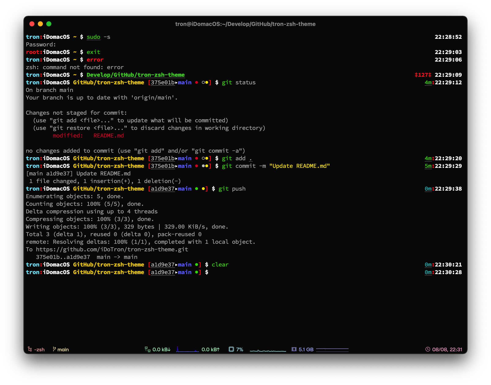

# tron-zsh-theme

A custom ZSH theme.

## Show

* User and Hostname.
* Working directory.
* Current time.
* Return status of the last command executed.
* Git status.
  * Branch.
  * Short SHA.
  * Clean, dirty and ahead working directory.
  * Staged or not.
  * Time since commit.

## Install

Move the `tron.zsh-theme` file to the `~/.oh-my-zsh/custom/themes/` directory and set the theme to `ZSH_THEME="tron"` in the `~/.zshrc` file. 

## Configure

You can set the theme style in the first line of this `tron.zsh-theme` file. 

Set `THEME="Normal"` to `Normal` or `Background`. 

